# Sidebar status-group evidence

Source commit: [`12bf20aa`](https://github.com/bailycase/shepherd/commit/12bf20aace34a3e3537cd5c903b034666ef863eb).

These are native SwiftUI/AppKit screenshots from the implementation, not redraws of the supplied design. Fixture state goes through the real view model, completion tracking, pinning and sidebar projection. Full-window images use an in-process host and stub pi. No production state or real provider turns.

84 unmodified PNGs. `manifest.json` records their dimensions, SHA-256 checksums, source commit and validation commands. This evidence branch is not intended to merge into Nightly.

## Activity states

| State | Light | Dark |
| --- | --- | --- |
| All groups expanded | 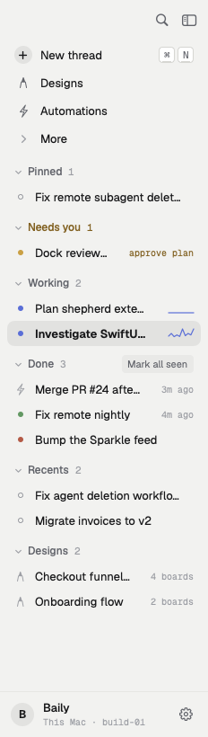 | 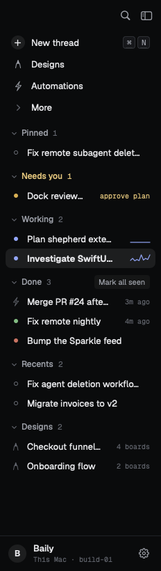 |
| Working, Recents and Designs folded independently | 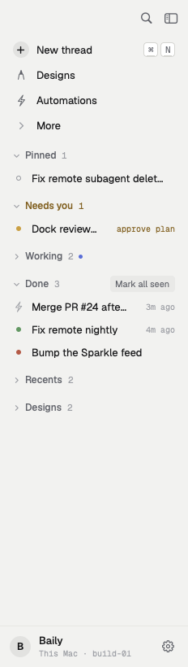 | 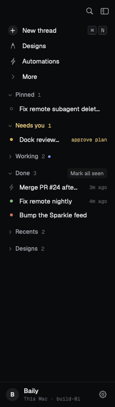 |
| Every group folded; counts and Working running dot remain | 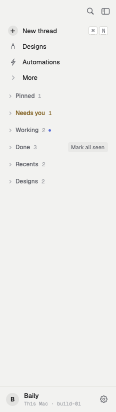 | 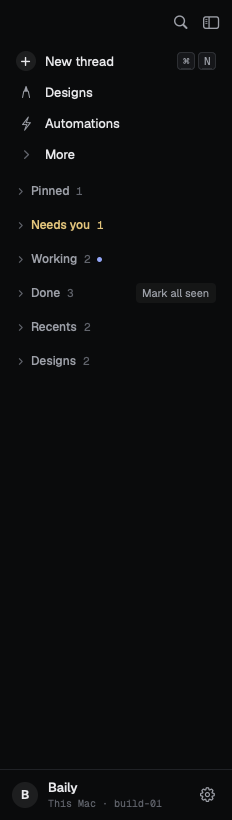 |
| Done folded; Mark all seen remains available | 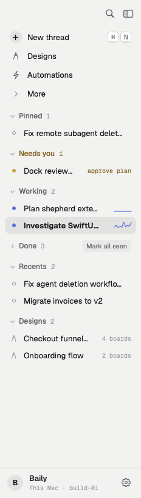 | 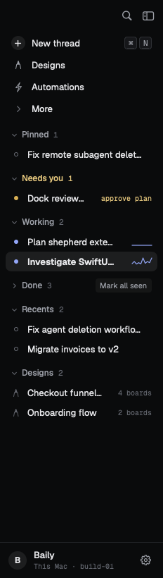 |
| Reading Done; the selected completion stays in Done | 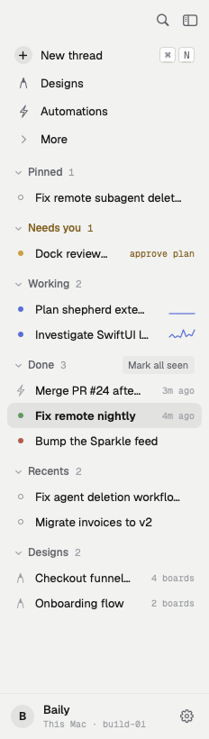 | 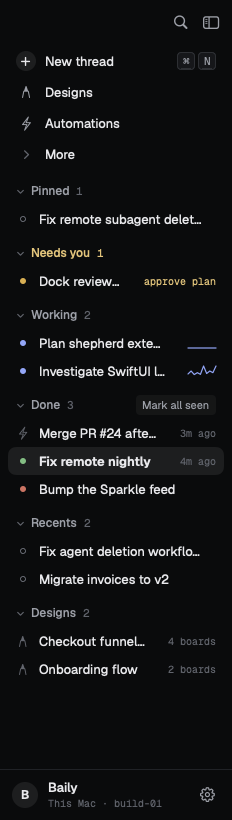 |
| Opening another thread; read completion moves to Recents, Done count falls | 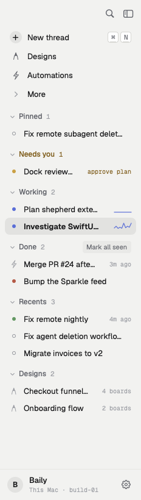 | 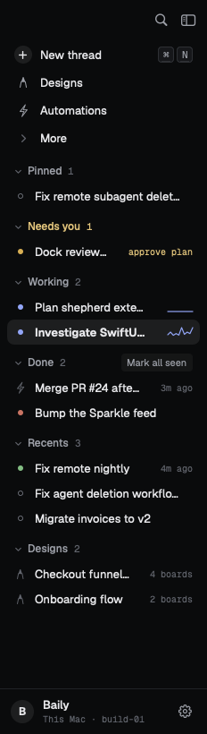 |
| After Mark all seen; Done disappears and cleared rows join Recents | 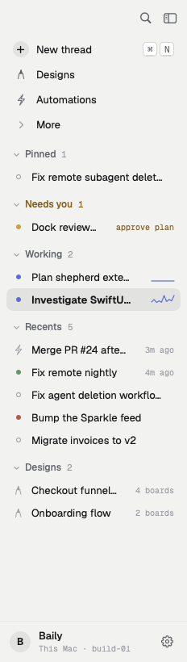 | 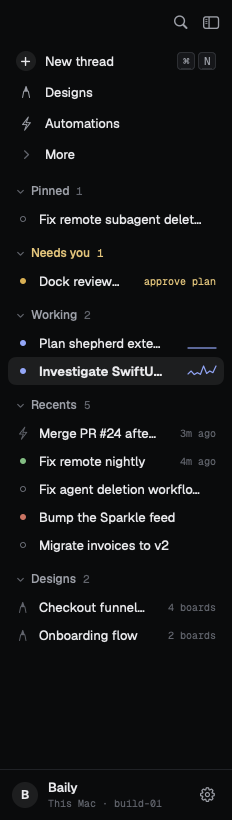 |
| Empty workspace; no activity headers | 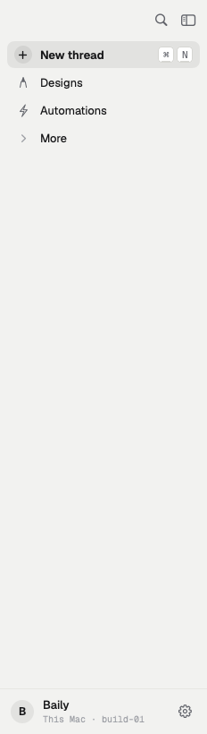 | 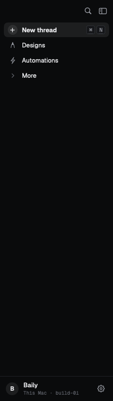 |
| Long thread and design titles | 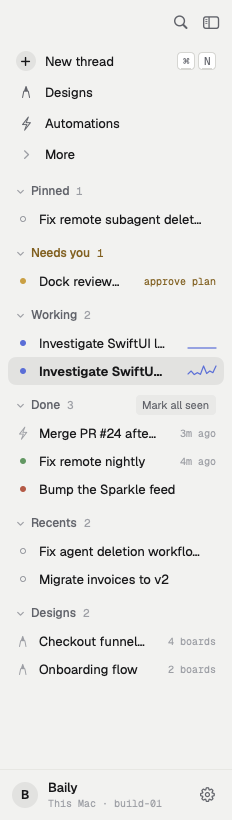 |  |

## Activity states at text scale 1.3

| State | Light | Dark |
| --- | --- | --- |
| All groups expanded | 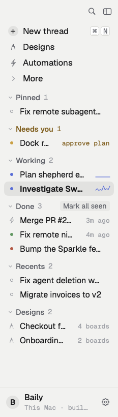 |  |
| Working, Recents and Designs folded independently | 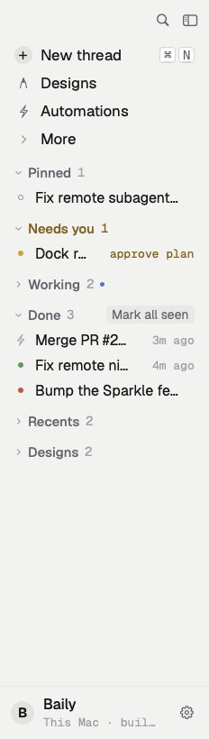 | 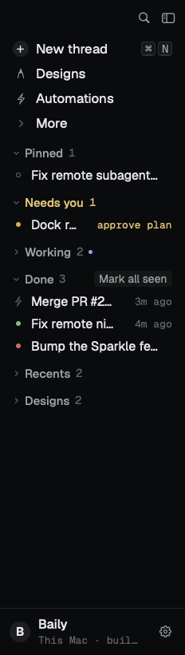 |
| Every group folded; counts and Working running dot remain | 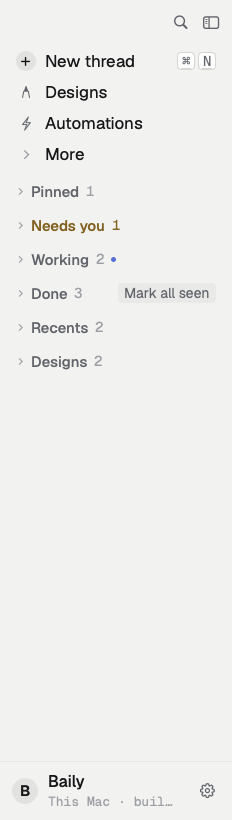 | 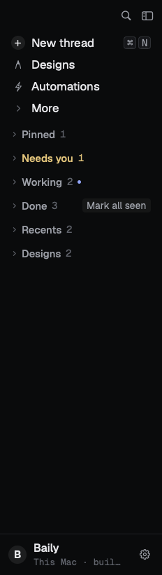 |
| Done folded; Mark all seen remains available | 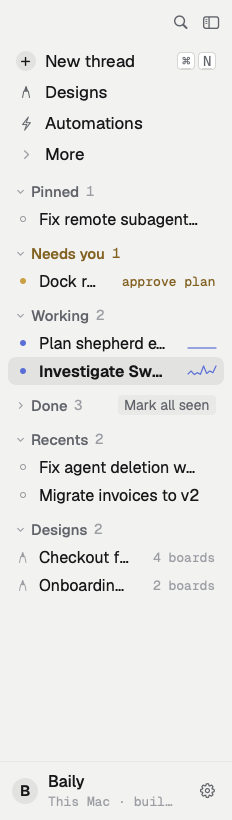 | 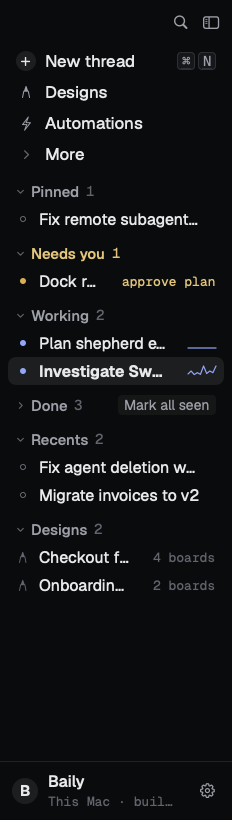 |
| Reading Done; the selected completion stays in Done | 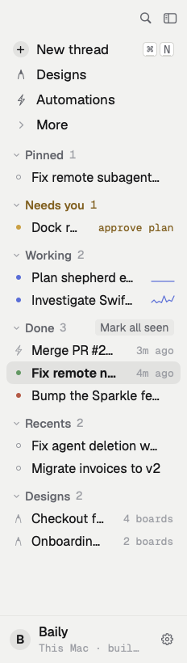 | 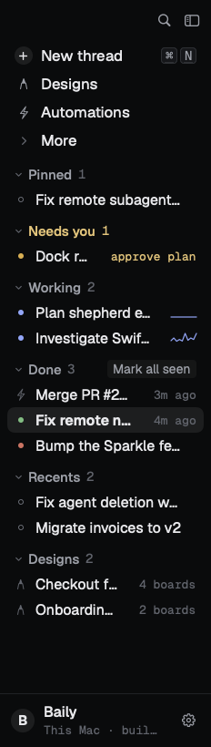 |
| Opening another thread; read completion moves to Recents, Done count falls | 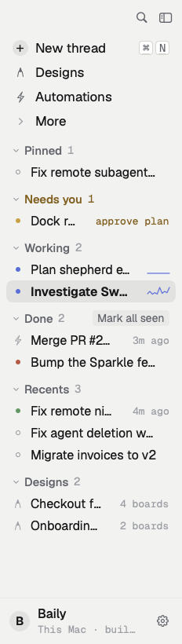 | 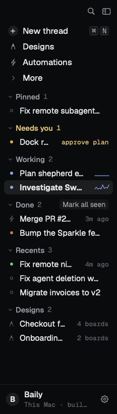 |
| After Mark all seen; Done disappears and cleared rows join Recents | 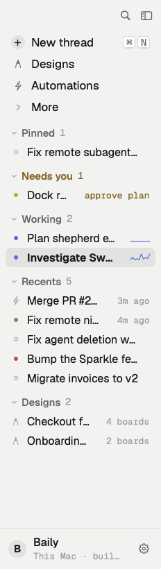 | 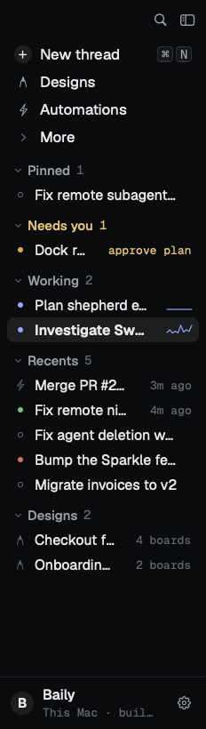 |
| Empty workspace; no activity headers | 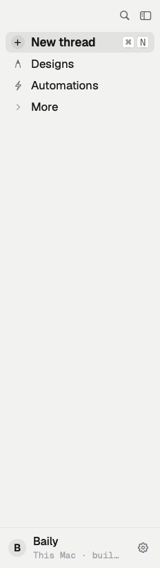 | 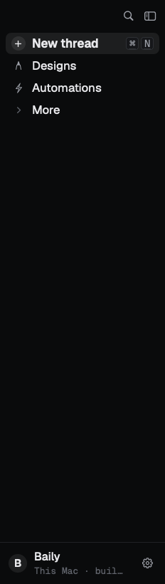 |
| Long thread and design titles | 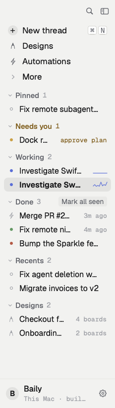 | 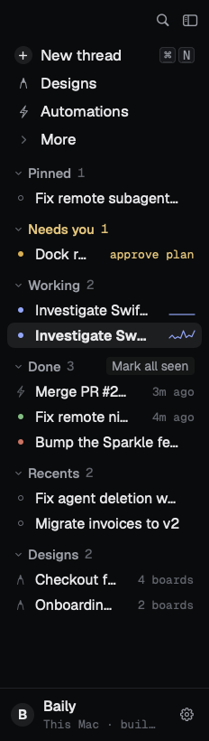 |

## Pinned, densities, failure states, remote, Projects and full windows

| State | Light | Dark |
| --- | --- | --- |
| The same pinned thread while idle | 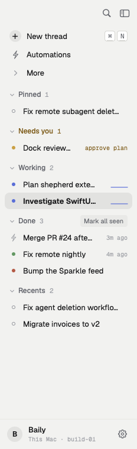 | 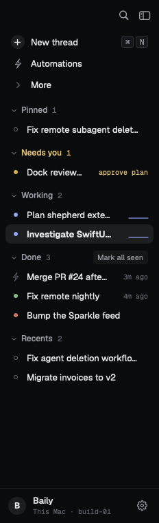 |
| The same pinned thread while working |  | 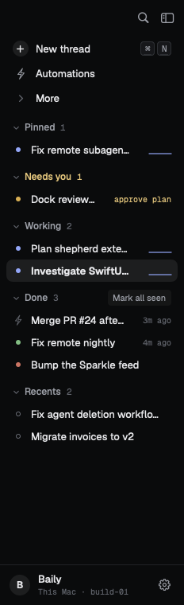 |
| The same pinned thread while asking, with its reason | 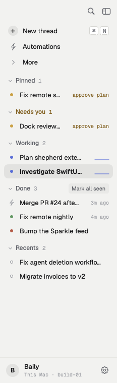 | 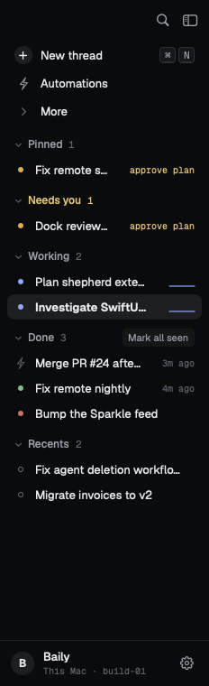 |
| The same pinned thread when done | 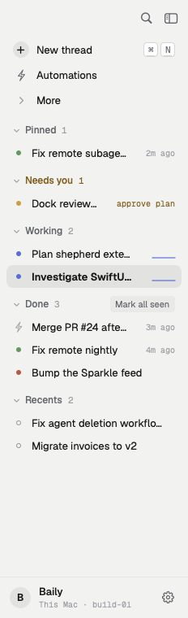 | 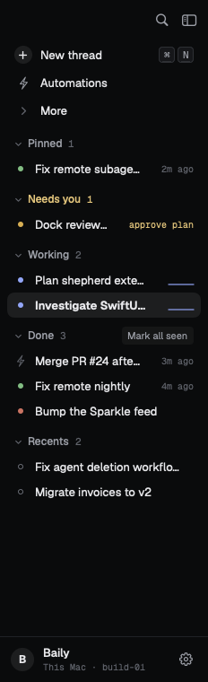 |
| Multiple pins retain pin order and contain the asking thread | 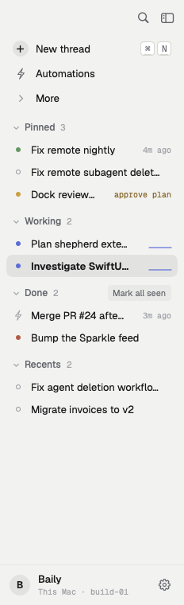 | 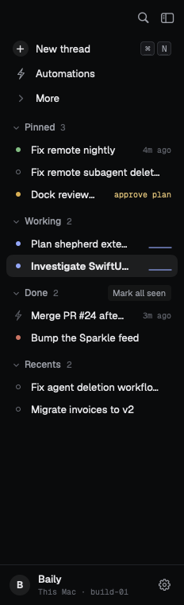 |
| Command-digit hints follow visible pinned and activity rows | 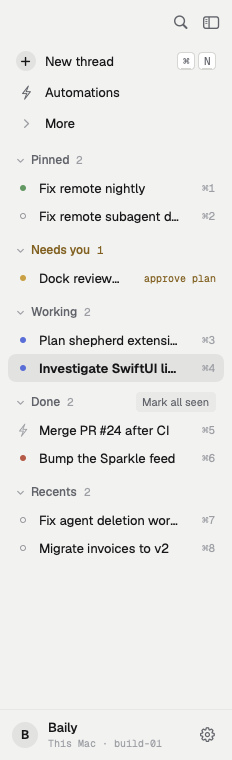 | 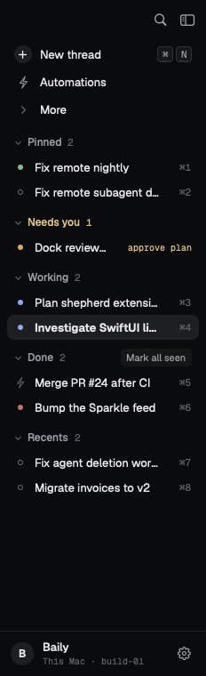 |
| Compact density, 22pt thread rows and 24pt minimum header hit areas | 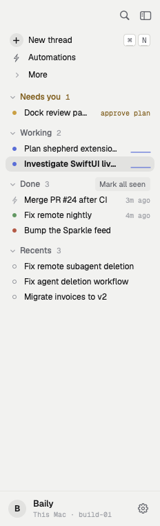 | 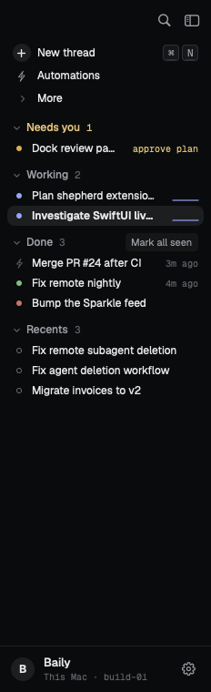 |
| Standard density, 28pt thread rows | 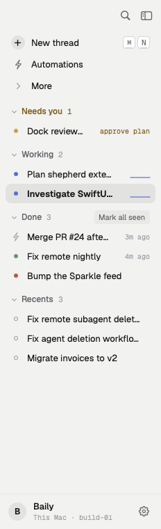 | 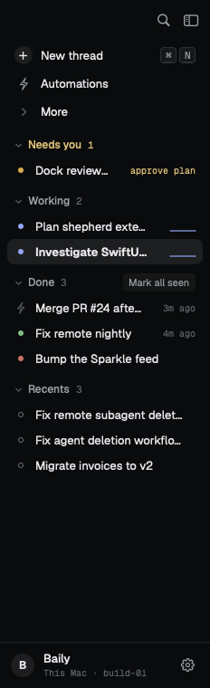 |
| Comfortable density, 36pt thread rows | 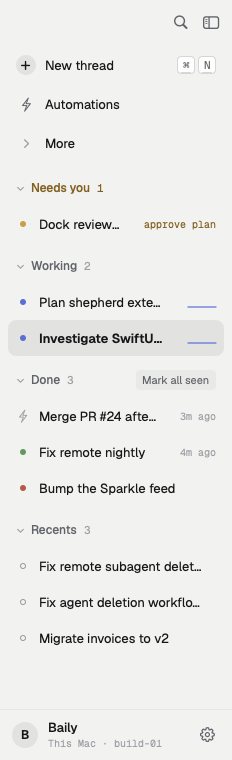 |  |
| Question reasons and fallback text |  |  |
| Running, asking and settled automation rows |  |  |
| Cannot start, with the red state and trailing reason |  |  |
| Waiting for import and not signed in |  |  |
| Hosts destination with its offline count |  |  |
| Remote activity rows retain host tags |  |  |
| Projects organization, Standard density |  |  |
| Projects organization, Compact density |  |  |
| Several open projects |  |  |
| Projects organized by host, including unreachable host |  |  |
| Remote projects and host tags |  |  |
| Project folder-row states and accessories |  |  |
| Full native window with a live stub-pi turn |  |  |
| Minimum native window with automatically hidden sidebar |  |  |
| Native window header when the sidebar is hidden |  |  |

## Reproduce

```sh
swift test --filter 'ShepherdAppUnitTests.(Sidebar|Design|Pin)|ShepherdAppIntegrationTests.(Sidebar|WorkspaceNavigation|DesignFlow|DesignLifecycleFlow|ListPerformanceTests)|ShepherdUIUnitTests.DesignRules'
SHEPHERD_PREVIEW_DIR=/tmp/shepherd-sidebar-pr-previews swift test --skip-build --filter 'PreviewTests.*(sidebar|appWindow\(surface)'
xcodebuild -project Shepherd.xcodeproj -scheme 'Shepherd (Dev)' -destination 'platform=macOS' -onlyUsePackageVersionsFromResolvedFile -derivedDataPath /tmp/shepherd-sidebar-pr-xcode build
python3 -m unittest discover -s Tests/Release -p 'test_agent_docs.py'
```
