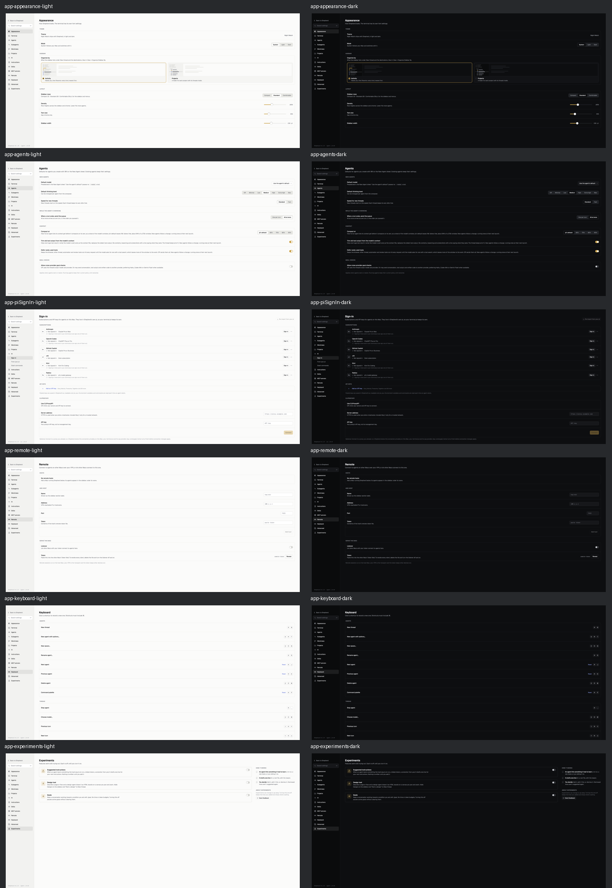
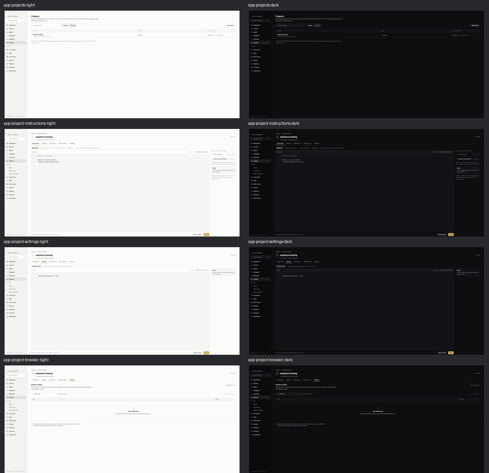
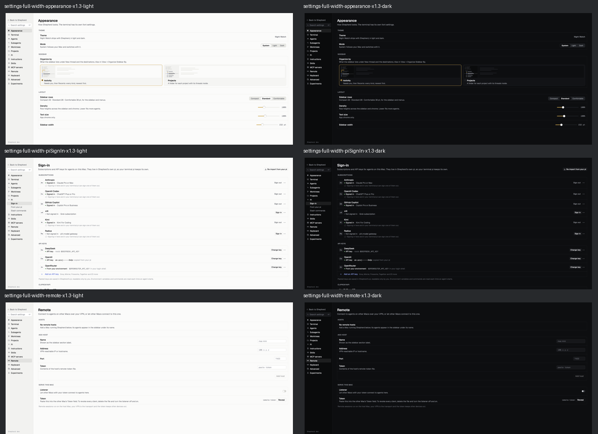

# Settings full-width requirement

The user's latest request replaces the fixed-column requirement from SettingsProjects and
ProjectBrowser revision 572. All Settings screens must use the available width, like the
Skills and Instructions pages. The supplied screenshots show the problem in a project editor
and the intended full-width Skills layout.

## Checklist before implementation

- Keep the 232pt navigation, its supplied `NWGlyph.Settings` artwork, fonts, colors, corner
  radii, search, current page selection and all existing strings and actions unchanged.
- Align every Settings page to the existing wide-page 40pt side gutters,
  `AppLayout.settingsWideSides`. No centered 720pt or 860pt page cap remains.
- Keep each page's current vertical spacing and scrolling behavior. Skills, root Instructions,
  MCP servers and Experiments already fill their container and keep their reference rails.
- Projects list and all project categories use the same available width. The project editor
  expands beside its 250pt context rail, with the existing 20pt gap. When the editor and rail
  cannot fit, stack them and keep native scrolling and Save/Open controls reachable.
- Retain text measures, individual field/filter widths, fixed reference rails and modal
  widths. Full-width pages do not mean stretching icons, toggles, popovers or text fields.
- Render from the real Settings models and scratch project files. Titles, paths, counts,
  status labels and editor metadata come from their producers, not the screenshot examples.
- Check both appearances, text scale 1.3, ordinary and very wide windows, empty and long
  content. Navigate to every page through its native accessibility control. Verify page
  bounds, project editor/table bounds and reachable controls after a window resize.
- Run existing file/cookie controls to protect Save, discard, Cancel and project isolation.

## Verification

- Native `ControlPress` visits every Settings destination, including Pi subpages, in the real
  RootView window. After resizing to 1280, 1440 and 2400pt, page bounds fill the available
  width with 40pt side gutters.
- Project editor and footer bounds fill the page at 1440pt. The context rail remains 250pt,
  separated by 20pt. At 1050pt it stacks below the editor; Save/Open stay inside the viewport
  with at least 24pt hit areas at both text scales. Native Save writes and reads back real
  scratch-project files.
- Browser tables follow each resized viewport instead of keeping the old 860pt cap. Clear,
  Cancel and confirmation tests retain cookie isolation.
- The Dev build succeeds with locked packages. Release/documentation checks pass, 421 tests.
  The final focused Swift run passes, 45 tests in 15 suites. A follow-up CI check exposed two
  test assumptions. The narrow-editor check enables legacy scrollbars and compares the AX
  group with the available width, with or without the measured native scrollbar reservation.
  macOS 26 reports the outer group, while 27 reports the clipped children. Nine focused
  follow-up checks pass with CI=true. The history-retry test uses its own sessions directory
  so other tests cannot add projects to its listing.
- `app/` contains 40 off-screen running-app captures at 2400 x 1100pt, in both appearances.
  The bundled Dev executable uses a live scratch SessionServer, real project files, skill
  data and WebKit storage. The temporary capture launcher is not shipped.
- `previews/` contains 152 selected renders, including every Settings page at 2400pt in both
  appearances and text scales, Project instructions with empty/long text, stacked narrow
  layouts, Browser empty/error/confirmation states and the project list.

Departures: none from the latest full-width request. Individual controls and reference rails
stay fixed as they do on the named Skills and Instructions pages. The earlier boards' page
widths are superseded, not retained as exceptions.

Local runtime validation used macOS 27.0.1. macOS 26 was not available here.
