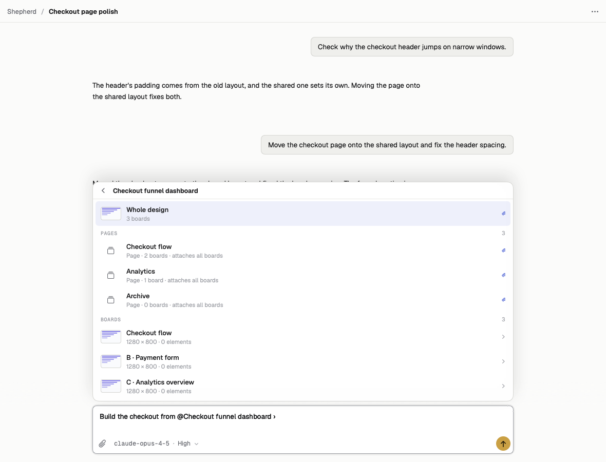
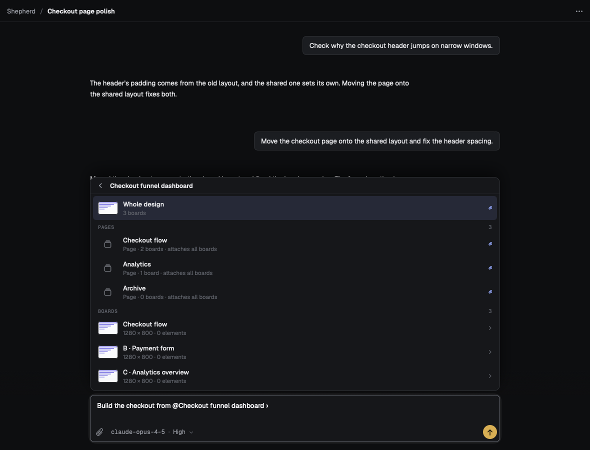
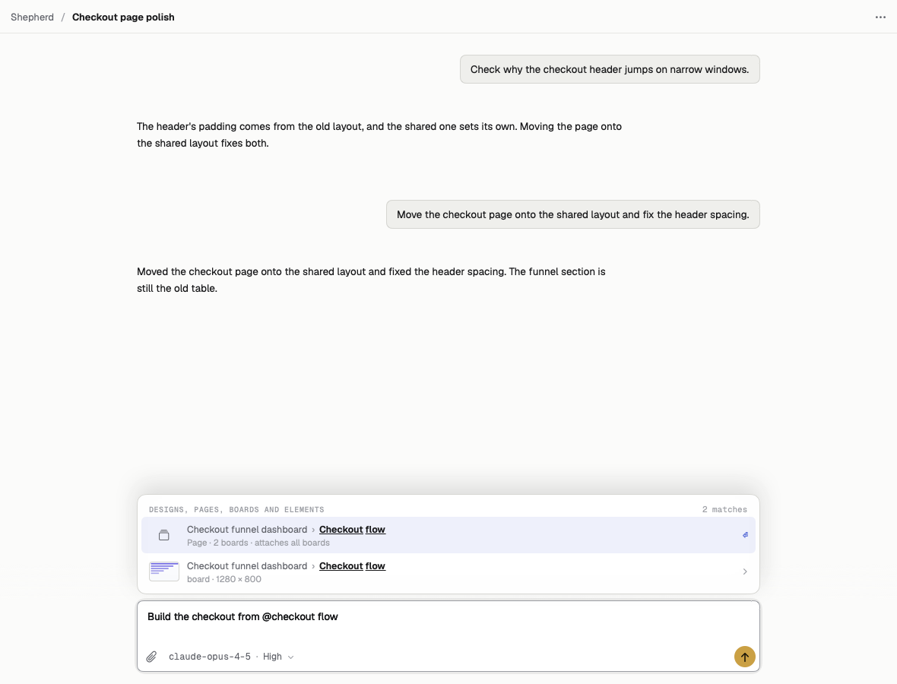
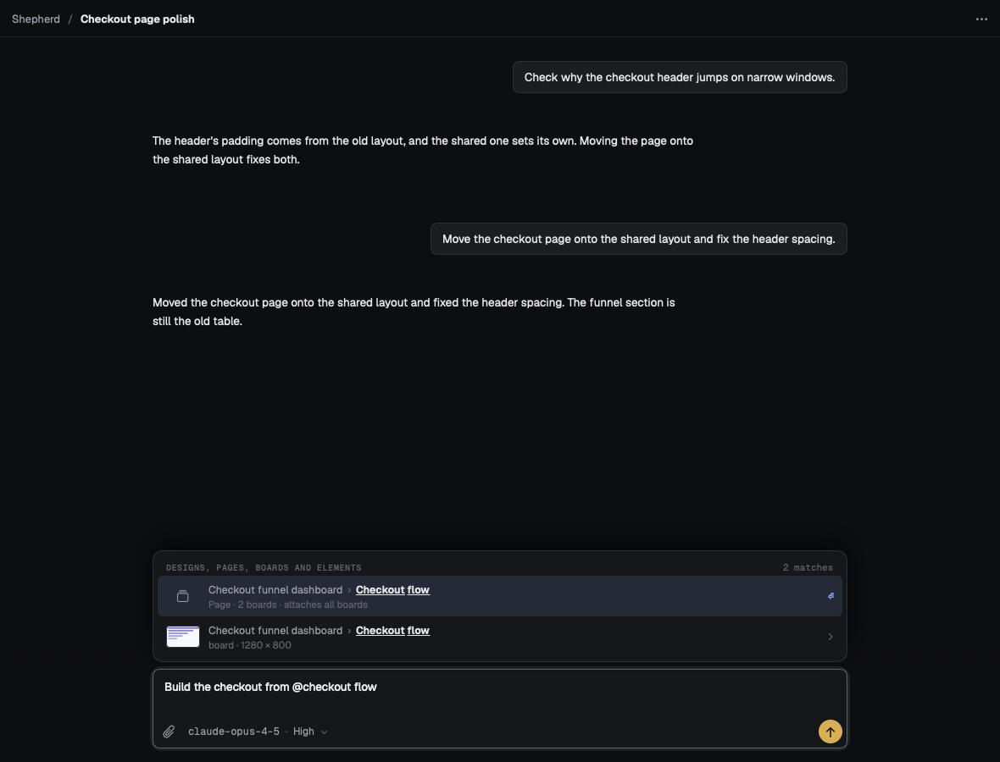
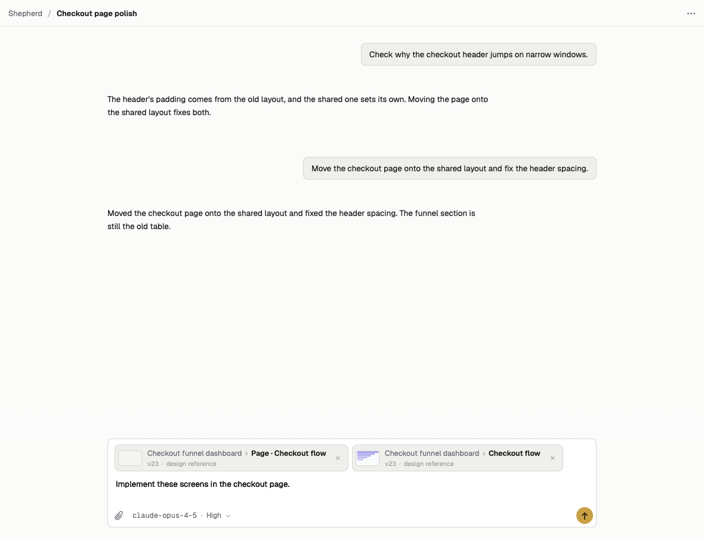
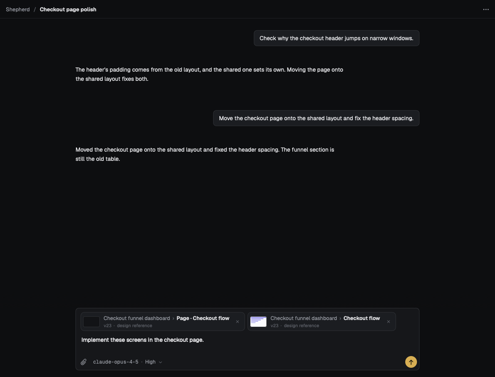

# Page mentions

Actual Mac thread UI renders from the shared design mention catalog and thread preview fixtures. No live model or production state is used.

Inside a design, the `@` picker has separate Pages and Boards sections. Page rows show a stack glyph, the board count and "attaches all boards". Picking a page attaches one reference containing every board on that page at the selected revision. Boards still drill into Whole board and Elements.

Search distinguishes a page and board even when both are named "Checkout flow". The attached page chip says "Page · Checkout flow"; a board can remain attached beside it.

## Picker




## Search




## Attached together




## Reproduce

```bash
SHEPHERD_PREVIEW_DIR=/tmp/shepherd-page-mentions-previews \
  swift test --filter 'ThreadPreviewTests/reference(AtPage|WithPage)'
```

The four preview cases also render empty pages, long page names and text scale 1.3 in both appearances. The page and board picker flow test uses real AppKit text input and accessibility presses to pick both kinds and remove only the page chip.

Departures: none.
